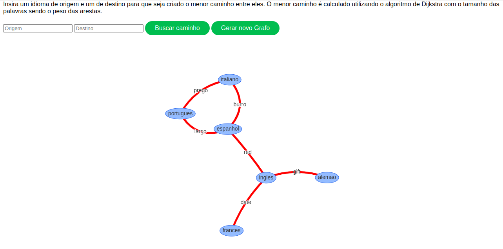
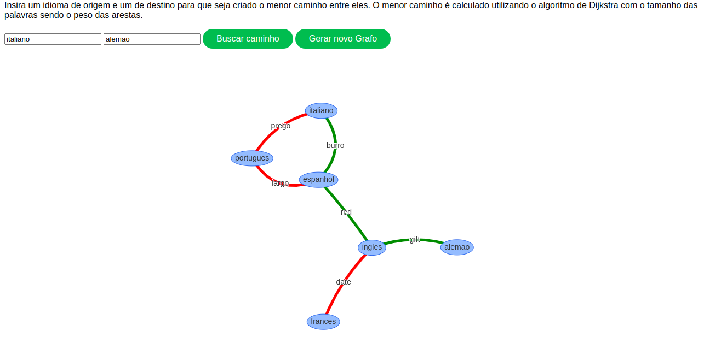

 # Babel

**Número da Lista**: 2 
**Conteúdo da Disciplina**: Grafos 2 

## Alunos
|Matrícula | Aluno |
| -- | -- |
| 16/0014433  |  Maria Luiza Ferreira |
| 15/0009313  |  Felipe de Oliveira Hargreaves |

## Sobre 
Este trabalho foi a evolução do primeiro projeto de Grafos 1. Utilizando o algortimo de Dijkstra para obter o menor caminho entre dois idiomas.

A ideia foi uma adaptação do exercício do URI (https://www.urionlinejudge.com.br/judge/pt/problems/view/1085). O grafo foi construído com algumas palavras que são comuns a mais de um idioma, mesmo que não necessariamente tenham o mesmo significado.É precido indicar um idioma de origem e outro de destino e o algoritmo fica responsável por buscar o caminho com menor peso entre eles, utilizando o tamanho das palavras como peso das arestas. 

## Screenshots

#### Visão Geral 

#### Grafo Resolvido

## Instalação 
**Linguagem**: Python e HTML/JS  
 1. Instalar as dependências com `pip install -r requirements.txt`. [Instruções para instalação do Pip, caso já não esteja instalado.](https://pip.pypa.io/en/stable/installing/)
  2. Executar o comando `python babel_server.py` ou `python3 babel_server.py`. 
  3. Abrir o navegador e acessar `localhost:5000/babel`
  

## Uso 
O vídeo de execução do programa se encontra na pasta `videos` do repositório. 

É precido indicar um idioma de origem e outro de destino e o algoritmo fica responsável por buscar o caminho com menor peso entre eles, utilizando o tamanho das palavras como peso das arestas. Os grafos são gerados randomicamente, caso queira gerar outro grafo clique em Gerar novo grafo, caso queira que o algoritmo ache o menor caminho clique em Buscar caminho, então será indicado em verde o menor caminho entre os dois pontos.

